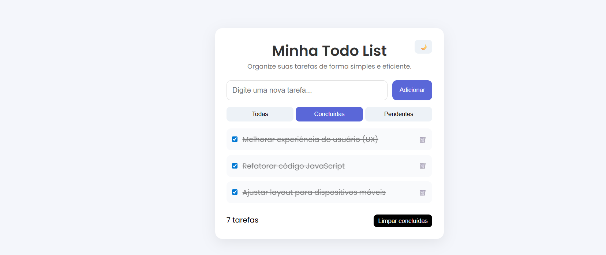
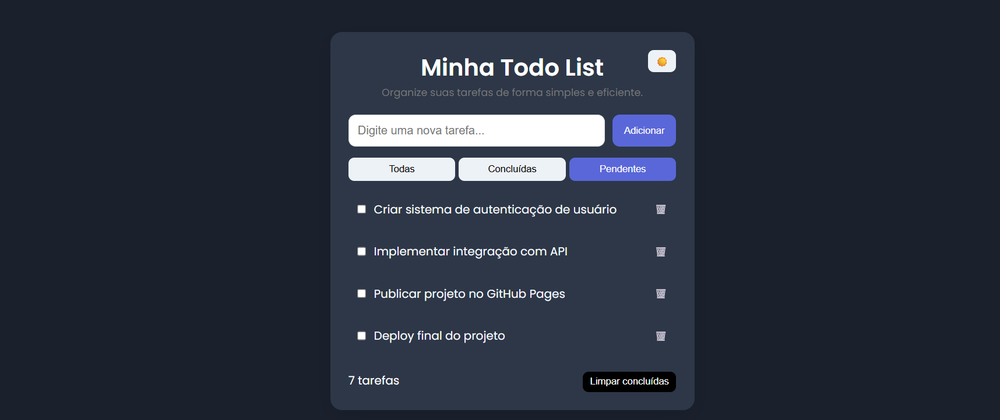

# 📝 Todo List

Uma aplicação web moderna de lista de tarefas desenvolvida com HTML, CSS e JavaScript.

---

## 🚀 Funcionalidades

- ✅ Adicionar tarefas
- ✔️ Marcar como concluída
- 🗑️ Remover tarefas
- 🔎 Filtrar tarefas (todas, concluídas e pendentes)
- 💾 Salvamento automático com LocalStorage
- 🌙 Modo Dark/Light
- 📱 Layout responsivo (mobile, tablet e desktop)

---

## 🛠️ Tecnologias utilizadas

- HTML5
- CSS3 (Flexbox + Media Queries)
- JavaScript (DOM + LocalStorage)

---

## 🎯 Objetivo do projeto

Este projeto foi desenvolvido com o objetivo de praticar:

- Manipulação do DOM
- Eventos em JavaScript
- Armazenamento local (LocalStorage)
- Responsividade
- Organização de código
- Experiência do usuário (UX)

---

## 📸 Preview

### ☀️ Modo Claro

### 🌙 Modo Escuro

---

## 🌙 Dark Mode

O projeto conta com modo escuro com alternância dinâmica e persistência utilizando LocalStorage.

---

## 📱 Responsividade

Aplicação adaptada para diferentes tamanhos de tela:

- 📱 Celulares
- 📲 Tablets
- 💻 Computadores

---

## 📌 Status

✅ Projeto finalizado  
🚀 Em constante evolução  

---

## 👨‍💻 Autor

Desenvolvido por Joalysson Santos🚀

 -💻 GitHub: https://joalyssonsouza.github.io/todo-list/
 -🔗 LinkedIn: www.linkedin.com/in/joalysson-santos
